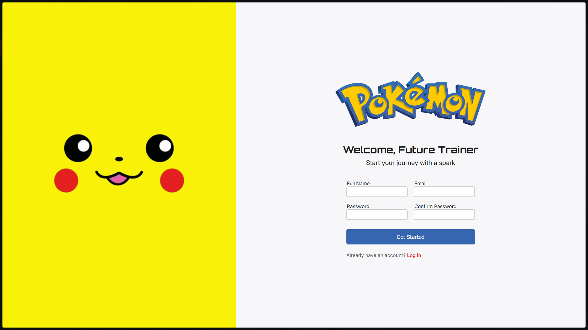

# Sign-Up Form (Pikachu Theme)

A simple, stylized sign-up form built for **The Odin Project**.  
The design uses a Pikachu-inspired yellow palette, clean typography, and a split layout with a hero image on the left and the form on the right.

## Features

- HTML form with name, email, password, and confirmation fields
- Flexbox two-column layout
- Custom color theme + Orbitron headings
- Animated inputs and button hover effects

## Tech

HTML5 • CSS3 • Google Fonts (Inter, Orbitron)

## Usage

Open `index.html` in your browser to view the project.
